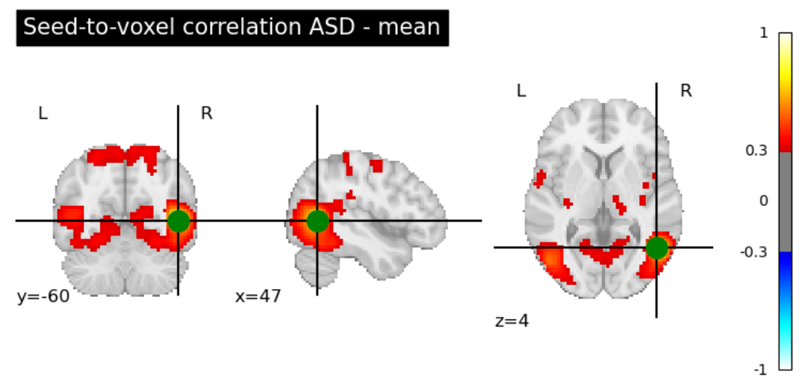
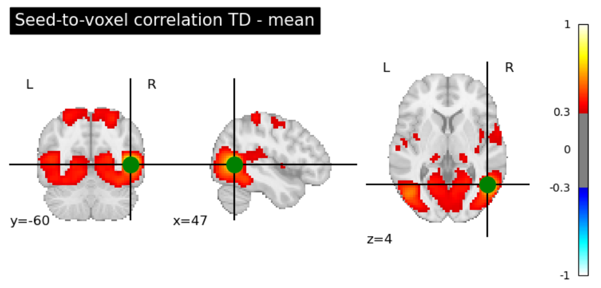

# Diagnostic des troubles du spectre de l’autisme grâce à des IRM fonctionnelles « resting-state »

## A propos de moi

Bonjour ! Je m'appelle Elodie Cussac et je suis actuellement en maîtrise professionnelle en génie biomédical à Polytechnique Montréal. Auparavant, j'étudiais l'ingénierie des biomatériaux aux Mines Nancy en France. A travers le cours Brainhack School, j'ai voulu découvrir le domaine de la neuroimagerie et améliorer mes compétences en programmation.

## Introduction

Les troubles du spectre de l’autisme (TSA) sont des troubles neurodéveloppementaux se manifestant notamment par des déficits de communication et des difficultés dans les interactions sociales. Aux Etats-Unis, environ 1 enfant sur 54 a été diagnostiqué avec TSA d’après le Center of Disease Control’s (CDC). Le diagnostic des TSA est établi grâce à des évaluations comportementales réalisées par un psychiatre ou un psychologue (Yang et al., 2022). Les récents progrès de la neuroimagerie permettraient d’obtenir des informations supplémentaires quant aux TSA. L’IRM fonctionnelle est particulièrement prometteuse dans ce domaine et pourrait permettre de mieux comprendre les différences de connectivité fonctionnelles aboutissant à différents profils cognitifs chez les individus atteints de TSA (Yang et al., 2022). 

L’IRM fonctionnelle est basée sur la mesure du signal magnétique dépendant du niveau d’oxygène. Suivant l’état de l’hémoglobine (oxygénée ou désoxygénée), ses propriétés magnétiques sont modifiées et cela impacte les temps de relaxation mesurés afin de construire l’image. Ainsi, il est possible de cartographier les zones actives du cerveau (celles demandant un flux sanguin oxygéné), de repérer quelles régions du cerveau sont synchronisées et ainsi d’observer le connectome fonctionnel. Les IRM fonctionnelles étudiées seront réalisées à l’état de repos (« resting state »), le sujet est conscient mais n’effectue aucune tâche. Cela permet d’observer l’activité intrinsèque des réseaux fonctionnels, certaines régions distantes présentent des activités synchronisées dans le temps (Hull et al., 2017). Les études de connectivité fonctionnelle sur les patients affectés par un TSA ont montré une sous-connectivité dans certains réseaux, les circuits de l’empathie, de compréhension des émotion d’autrui et de communication sont moins développés (Alaerts et al., 2013, Hull et al., 2017 et Yang et al., 2022).

**Comment l’IRM fonctionnelle « resting state » peut-elle être un outil de diagnostic pour les troubles du spectre de l’autisme ?**

## Objectifs

### Objectifs du projet

+ Analyse de la connectivité fonctionnelle entre les patients typiquement développés (TD) et les patients ayant des troubles du spectre de l’autisme (TSA)
   + Comprendre la structure de données des fichiers d’IRM fonctionnelles 
   + Explorer les outils d’analyse des IRM fonctionnelles
   + Identifier des premières différences entre les deux groupes (TD et TSA ou ASD en anglais)

+ Classification automatique entre les patients TD et les patients ayant des TSA
   + Définir les différents paramètres du modèle (données d’entrée, classifieurs, critères d’évaluation)
   + Sélectionner la classification optimale

+ Création d’un répertoire GitHub pour partager mes résultats

### Objectifs personnels 

+ Comprendre les concepts et les techniques d’analyse des IRM fonctionnelles
+ Améliorer mes compétences de programmation (apprentissage automatique, visualisation de données et manipulations de données)
+ Utilisation des bonne pratiques en neurosciences (terminal WSL, git et github)

## Données

Les données utilisées proviennent de la base de données ouverte ABIDE II (Autism Brain Imaging Data Exchange). Cette base de données contient 1114 jeux de données de 19 sites différents. 521 sujets sont atteints de TSA et 593 sont des sujets TD. Cette base de données est directement téléchargeable depuis python grâce à la bibliothèque Nilearn. Les données téléchargées sont des IRM fontionnelles prétraitées par le Preprocessed Connectome Projects (PCP). En raison du temps de calcul des algorithmes, il a été choisi de ne pas conserver l’entiereté des données pour le projet. Les études d’analyse de connectivité ont été réalisées à l’échelle individuelle ou sur un groupe de 100 individus (50 sujets ayant des des TSA et 50 sujets TD) et la classification automatique a été réalisée sur 500 individus (242 sujets ASD et 258 sujets TD). Les données phénotypiques associées aux 500 individus de la classification ont permis de tracer le graphique de la figure 1 et ainsi de valider l’absence de différence importante d’âge entre les deux groupes. 

  
   
  <em>Figure 1 : Âge et genre en fonction du diagnostic</em>

Ces données vont permettre d’analyser les différences de connectivité fonctionnelle entre les IRM fonctionnelles à l’état de repos des individus ayant des TSA et celles des individus TD. Le nombre de données assez important permettra de proposer une classification automatique.

## Outils 

+ Git et github pour le contrôle de version et le partage de mon projet
+ Jupyter Notebook pour l'écriture l'écriture du code
+ Différentes librairies de Python : numpy, pandas, matplotlib, seaborn, plotly, nilearn, nibabel, scikitlearn

## Livrables

+ Répertoire Github contenant tous les éléments du projet
+ Fichier markdown pour décrire le projet
+ Deux fichiers jupyter notebook : 
   + func_connectivity_analysis : Exploration des outils et analyse de la connectivité fonctionnelle
   + machine_learning : Modèles et résultats pour les différentes classifications testées

## Méthodes et résultats

### Analyse de la connectivité fonctionnelle 

#### Approche basée sur la corrélation des voxels avec une graine

Une première démarche basée sur l’article d’Alaerts et al. (2013) a été entreprise afin d’observer les différences de connectivité fonctionnelle entre les individus atteints de TSA et les individus TD. Celle-ci consiste à l’observation des corrélations entre une graine placée dans le sillon temporal supérieur postérieur (appelé pSTS, les coordonnées dans le template MNI étaient indiquées par l’article : [47, -60, 4]) et le reste des voxels du cerveau. Les corrélations sont calculées par rapport aux séries temporelles de chaque zone. Le pSTS a été choisi comme zone où placer la graine car celui-ci est fortement connecté à plusieurs régions du cerveau social et plusieurs études ont préalablement montré qu’il était affecté fonctionnellement dans les cas de TSA (Alaerts et al., 2013).
Ainsi, les cartes de corrélation ont été calculées pour le groupe atteint de TSA et pour le groupe TD, celles-ci sont présentées à la figure 2 et 3. De premières différences sont visibles, mais sont difficiles à interpréter. 

  
   
  <em>Figure 2 : Carte de corrélations entre la graine et les autres voxels pour l'individu atteint de TSA</em>

  
   
  <em>Figure 3 : Carte de corrélations entre la graine et les autres voxels pour l'individu TD</em>

Comme cela est fait dans l’article d’Alaerts et al., la corrélation entre le pSTS et le lobule pariétal inférieur (IPL) peut être analysée plus en détails. Cette analyse est d'abord faite à l'échelle individuelle, comme cela a été fait dans l'article, pour le sujet 278 atteint de TSA et le sujet 306 étant TD. L'IPL a pour coordonnées [32, -36, 49] dans le système MNI et est indiqué par la croix noire sur la figure 4. Cette figure montre la superposition des cartes de corrélations entre pSTS et l’ensemble du cerveau pour l’individu ayant des TSA (rouge) et pour l’individu TD (bleu). Un seuil a été placé à 0.6, cela signifie que seules les corrélations supérieures à 0.6 sont affichées. 

Chez l'individu TD, une corrélation importante est observable entre le pSTS et l'IPL, mais ce n'est pas le cas chez l’individu affecté par un TSA. D’après les études menées par l’équipe d’Alaerts et al., la sous-connectivité entre ces deux zones chez l'indivu ayant un TSA indique une capacité réduite à identifier les émotions.

  
   
  <em>Figure 4 : Superposition des cartes de connectivité de l'individu atteint de TSA et de l'individu TD entre le sillon temporel supérieur postérieur et le lobule pariétal inférieur</em>

Notons qu'afin d'avoir des résultats reproductibles les deux sujets choisis sont les mêmes que ceux étudiés dans l’article d’Alaerts et al. Cependant, lorsque l’analyse est réalisée au niveau des groupes (groupe TSA et groupe TD), aucune différence de connectivité notable entre le pSTS et l'IPL n’est relevée entre les deux groupes.

#### Approche basée sur les matrices de corrélation

Une autre approche a consisté à appliquer un atlas aux données. L’atlas permet de diviser le cerveau en plusieurs zone d’intérêts et de réduire le nombre de dimensions spatiales des données. L'atlas MSDL est appliqué aux données, puis la matrice de corrélation entre les séries temporelles des différentes régions est calculée. Les figures 5 et 6 montrent des exemples de matrices de corrélation obtenue sur un groupe de 50 individus ayant un TSA et sur un groupe de 50 individus TD.

  
   
  <em>Figure 5 : Matrice de corrélation moyenne pour un groupe de 50 individus atteint d'un TSA</em>

  
   
  <em>Figure 6 : Matrice de corrélation moyenne pour un groupe de 50 individus TD</em>

Cette approche a montré des différences entre les deux groupes, mais celles-ci sont difficiles à interpréter. Cependant, comme cela a été fait dans l’article de Yang et al., les matrices de corrélation peuvent être calculées pour chacun des individus et servir de données d’entrée pour la classification automatique.

### Classification automatique

#### Méthode 

+ **Données d’entrée** 

Les 500 premiers individus du jeu de données ont été retenus pour réaliser la classification. Sur ces individus, 242 étaient atteints de TSA et 258 étaient TD. Pour chacun des sujets, la matrice de corrélation est calculée et l’étiquette de diagnostic est conservées (ASD ou TD). La matrice de corrélation sur les séries temporelles est calculée entre les différentes régions définies après l’application d’un atlas. Dans ce projet, trois atlas vont être testés : l’atlas Harvard Oxford communément utilisé en neuroimagerie, l’atlas Destrieux (Plitt et al., 2014) et l’atlas Basc197 (Yang et al., 2022). Ce dernier atlas, Basc197, est particulièrement intéressant car il a été construit à partir d’IRM fonctionnelles, contrairement aux précédents qui ont été construits à partir d’IRM anatomiques (Yang et al., 2022).

+ **Construction d’une base d’entraînement et d’une base de test**

Le jeu de données a ensuite été séparé en une base d’entraînement (75% des données) et une base de test (25% des données). Cette séparation a été faite de façon à avoir les mêmes proportions de sujets atteints de TSA et de sujets TD dans la base d’entraînement et la base de test.

+ **Essais de différents classifieurs** 

Plusieurs classifieurs sont ensuite testés. Pour chacun d’entre eux, une validation croisée à 10 plis est réalisée, ce qui permet de prédire les labels de la base d’entraînement, de calculer des scores et ainsi de comparer les classifieurs entre eux. Les quatre classifieurs testés sont la régression logistique (LR), la classification naïve bayésienne (GNB), la machine à vecteurs support (kSVM) et l’algorithme de Random Forest (RF). Pour chacun des modèles, une validation croisée est réalisée afin de définir les hyperparamètres optimaux.

+ **Evaluation du modèle**

Douze modèles ont été construits (pour chacun des trois atlas, les quatre classifieurs sont testés). Pour comparer ces douze modèles, il est essentiel de définir des métriques pertinentes avec l’étude. L’accuracy, la sensibilité ainsi que la spécificité seront calculées, car elles sont adaptées à l’évaluation d’un outil de diagnostic (Yang et al., 2022). L’accuracy correspond au nombre de prédictions réussies sur l’ensemble des prédictions réalisées, la sensibilité au nombre de vrais positifs sur l’ensemble des individus positifs et la spécificité au nombre de vrais négatifs sur l’ensemble des individus réellement négatifs. Ces métriques sont calculées grâce aux formules suivantes. 

$$ \text{Accuracy} = \frac{TP + TN}{TP + FP + TN + FN} $$

$$ \text{Sensibilité} = \frac{TP}{TP + FN} $$

$$ \text{Spécificité} = \frac{TN}{TN + FP} $$

#### Sélection du modèle 

Le tableau 1 regroupe les résultats d’accuracy, de sensibilité et de spécificité pour les douze modèles testés. Le modèle couplant l’atlas de Destrieux avec un classifieur kSVM semble intéressant en raison de sa sensibilité élevée. Cela est pertinent dans le cadre d’un test de diagnostic, car une sensibilité élevée réduit le nombre de patients atteints de TSA, mais classifiés TD. Cela réduit ainsi les retards de diagnostic et de prise en charge (Yang et al., 2022). Cependant, la faible spécificité de ce modèle signifie un nombre élevé de faux positifs (individus classifiés comme atteints de TSA, alors qu’ils sont TD).

Le modèle utilisant le classifieur kSVM avec l’atlas Basc197 permet d’avoir un bon compromis entre la sensibilité et la spécificité, et permet d’obtenir la meilleure accuracy parmi les modèles testés. Ce modèle est donc retenu pour la suite de l’étude.

  
   
  <em>Tableau 1 : Métriques de performance (accuracy, sensibilité, spécificité) pour différents classifieurs et différents atlas. Les meilleures performances sont mises en gras dans le tableau.</em>

#### Généralisation à la base de test et comparaison des performances avec la littérature

Le modèle utilisant l’atlas Basc197 et le classifieur kSVM a été sélectionné. Sur la base d’entraînement, il montre des scores de validation croisée élevés : 69.1% d’accuracy, 69.1% de sensibilité et 69.1% de spécificité. 

Afin de tester la robustesse du modèle, celui-ci est testé sur la base de test. La matrice de confusion obtenue est montrée à la figure 7. Le modèle affiche des performances comparables à celles obtenues lors de l’entraînement : l’accuracy est de 68.8%, la sensibilité de 71.9% et la spécificité de 65.6%. Ces résultats démontrent une bonne capacité de généralisation du modèle, même si il serait intéressant de tester le modèle sur plus de données ou sur une autre base de données.

  
   
  <em>Figure 8 : Matrice de confusion après classification sur la base de test</em>

L’équipe de Yang et al. a réalisé une étude sur 871 sujets de la base de données ABIDE II, l’accuracy de validation croisée obtenue avec l’atlas Basc197 et le classifieur kSVM est de 69.16%. Cela est très proche de ce qui a été obtenu dans ce projet.

## Conclusion

En premier lieu, l’analyse de connectivité fonctionnelle a montré son efficacité en tant qu’outil pour mieux comprendre les caractéristiques des TSA. En effet, en se basant sur la littérature, il a été possible de détecter des différences de connectivité fonctionnelle entre les individus atteints d’un TSA et les individus TD. Dans un deuxième temps, les matrices de corrélation sur les séries temporelles entre les différentes régions du cerveau définies par un atlas ont été utilisées pour réaliser une classification automatique. Les résultats obtenus sont pertinents avec les résultats de la littérature (Yang et al., 2022), cependant l'accuracy obtenue reste trop faible pour assurer un diagnostic fiable. Le diagnostic mené avec les données comportementales reste plus robuste (Plitt et al., 2014). Ainsi, de nouveaux biomarqueurs et des modèles plus performants doivent être explorés pour utiliser l’IRM fonctionnelle à l'état de repos comme un moyen de diagnostic des TSA.

## Remerciements

Je tiens à remercier l’ensemble des organisateurs de Brainhack School qui ont créé ce cours, les modules ainsi que le serveur discord. Ce cours m’a permis d’en apprendre plus sur les méthodes d’analyse d’IRM fonctionnelles, ainsi que d’adopter les bonnes pratiques dans un projet de neuroimagerie. Je remercie tout particulièrement Dr. Eva Alonso Ortiz pour ses conseils qui m’ont permis de définir mon sujet, ainsi que les chargés de travaux dirigés de Polytechnique Montréal, Jan et Daniel, qui ont su répondre à mes interrogations tout au long du projet. 

## Références

Alaerts, K., Woolley, D. G., Steyaert, J., Di Martino, A., Swinnen, S. P., & Wenderoth, N. (2014). Underconnectivity of the superior temporal sulcus predicts emotion recognition deficits in autism. Social Cognitive and Affective Neuroscience, 9(10), 1589 1600. https://doi.org/10.1093/scan/nst156

Hull, J. V., Dokovna, L. B., Jacokes, Z. J., Torgerson, C. M., Irimia, A., & Van Horn, J. D. (2017). Resting-State Functional Connectivity in Autism Spectrum Disorders : A Review. Frontiers in Psychiatry, 7. https://doi.org/10.3389/fpsyt.2016.00205

Plitt, M., Barnes, K. A., & Martin, A. (2014). Functional connectivity classification of autism identifies highly predictive brain features but falls short of biomarker standards. NeuroImage : Clinical, 7, 359 366. https://doi.org/10.1016/j.nicl.2014.12.013

Yang, X., Zhang, N., & Schrader, P. (2022). A study of brain networks for autism spectrum disorder classification using resting-state functional connectivity. Machine Learning with Applications, 8, 100290. https://doi.org/10.1016/j.mlwa.2022.100290 